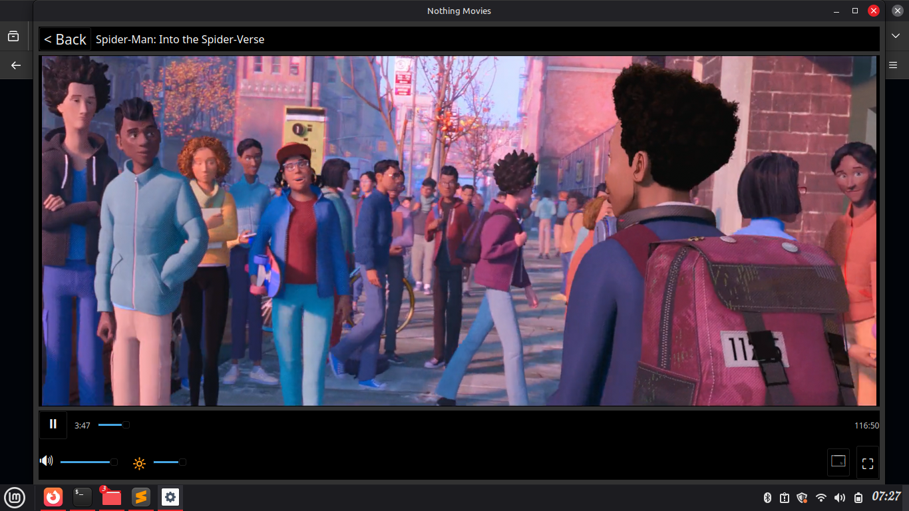
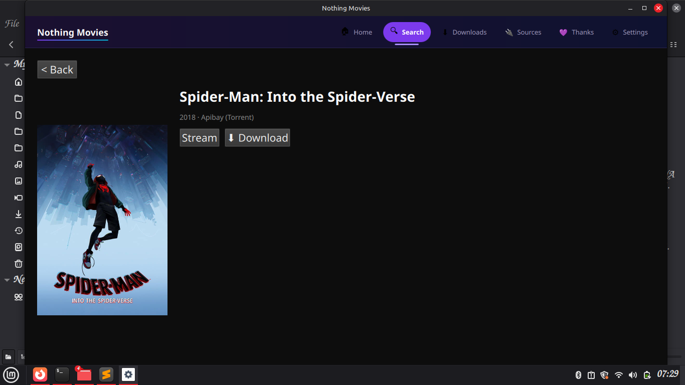
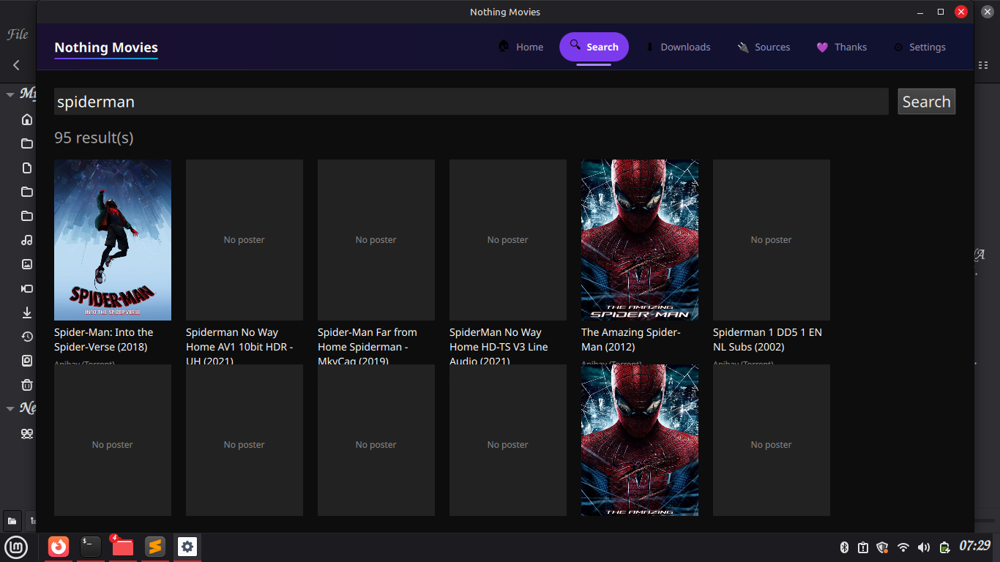
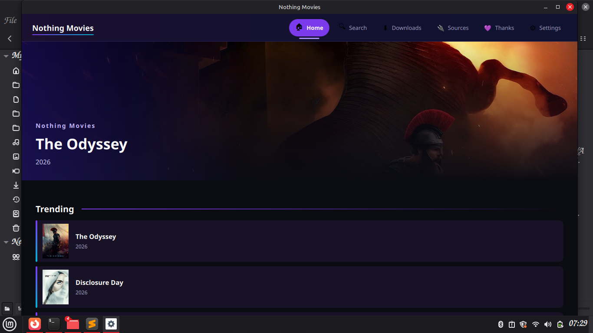
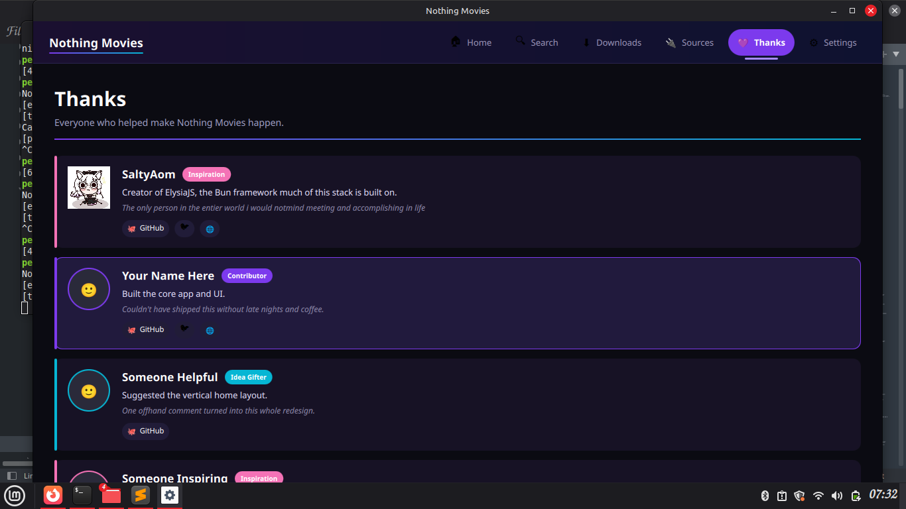
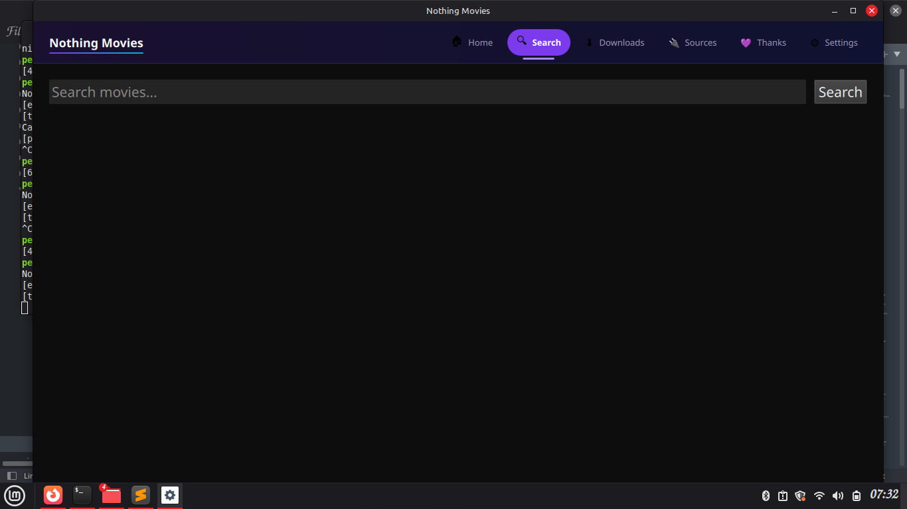
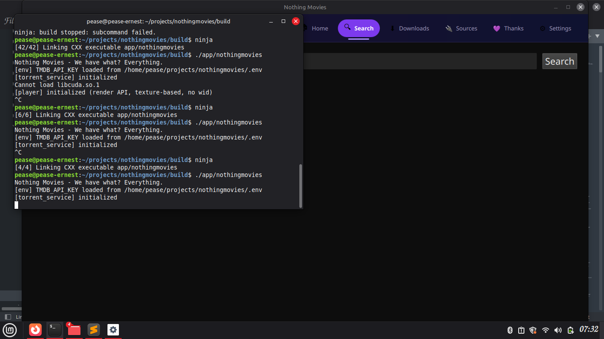

# Nothing Movies

**We have what? Everything.**

A cross-platform (Windows/Linux) movie downloader, torrent streamer, and video
player, built entirely in C++/Qt6. No JS, no Python, no Electron — one language,
one toolchain, top to bottom.

---

## What this is

Nothing Movies aggregates movie sources, downloads via torrent or direct HTTP,
and plays everything back through a fast, intuitive native player. It bundles
[Nothing Browser](https://github.com/BunElysiaReact/nothing-browser) as a
vendored, auto-updating binary dependency for page rendering and network
capture — we don't fork or modify it, we just consume its releases.

Built and maintained with **Ernest Tech House** as main sponsor, hosting this
project under their GitHub organization.

## Status

Development is going better than expected. The player backend just had a
full rewrite: video used to be embedded via mpv's `wid` option, a raw native
window glued into the Qt layout that had to be manually fought for
compositing, overlays, and stacking order. It now renders through libmpv's
render API straight into an OpenGL FBO owned by a normal `QWidget` — the
same "video as a texture in your own draw pipeline" approach VLC's Qt
frontend uses. That one change already unblocks proper overlay controls,
in-app picture-in-picture, and reliable page switching with no native-window
workarounds needed.

Downloads screen now reflects what's actually sitting in the download folder
instead of only in-memory session state, so finished downloads survive an
app restart. Credits page is live.

UI is still rough — functionality first, styling later. Screenshots below
are straight from the dev build, warts and all.

## Screenshots

<p align="center">
  
  
  
</p>
<p align="center">
  
  
  
</p>
<p align="center">
  
</p>

## Architecture

Every component is an isolated module — no module reaches into another's
internals. Communication only happens through clean interface headers.

| Module | Responsibility |
|---|---|
| `core` | Shared interfaces (`ISourceProvider`, etc.) |
| `player` | libmpv-based video playback, render-API texture rendering (no native window embedding) |
| `torrent_service` | libtorrent-rasterbar, sequential streaming — the primary, reserved source (slot 1) |
| `downloader` | Generic HTTP/file downloads |
| `metadata_cache` | SQLite: posters, resume position, watch history |
| `search_aggregator` | Merges/ranks results across all sources |
| `queue_manager` | Unified download queue (torrent + HTTP) |
| `movie_source1/2` | Pluggable, isolated source providers (see slot system below) |
| `scraper_core` | Drives the vendored Nothing Browser binary |
| `vendor_updater` | Background sync with defined release links (Nothing Browser and any source-required tools) |
| `ui` | Qt Widgets + QML frontend |
| `app` | Entry point, links everything together |

## Movie source slots

The app has a **hard limit of 8 source slots** — this is intentional, not
a technical constraint. See [`MOVIE_SOURCE.md`](./MOVIE_SOURCE.md) for the
full rules.

- **Slot 1** — the torrent service, the app's core. Not replaceable.
- **Slot 2** — reserved and maintained by Ernest Tech House.
- **Slots 3–8** — open for community-submitted sources, subject to review.

There is no "download from URL" option. Every source is built into the
binary at compile time — this is by design, to keep both quality and count
under control.

## Building

```bash
mkdir build && cd build
cmake .. -GNinja
ninja
```

Requires Qt6 (Widgets, OpenGLWidgets, Quick, Qml), libmpv, libtorrent-rasterbar,
curl, nlohmann-json, miniz. See `CMakeLists.txt` in each module for exact
dependency targets.

## Versioning

Your current build version is always visible in **in-app Settings.**

- `v0.0.1-beta` (with `-beta` suffix) → **beta build** — may be unstable,
  may change without notice
- `v0.0.1` (no suffix) → **official/stable build**

Always check Settings and include your exact version string when reporting
a bug — see [`SECURITY.md`](./SECURITY.md) and issue templates.

---

## Project documents

Read these before contributing or filing issues:

| Document | What it covers |
|---|---|
| [`WARNING.md`](./WARNING.md) | What this project is and isn't for |
| [`LICENSE.md`](./LICENSE.md) | PolyForm Noncommercial 1.0.0 |
| [`ADDITIONAL_TERMS.md`](./ADDITIONAL_TERMS.md) | Extra conditions on top of the license |
| [`MOVIE_SOURCE.md`](./MOVIE_SOURCE.md) | Rules for submitting a movie source |
| [`MOVIE_SOURCE_LICENSE.md`](./MOVIE_SOURCE_LICENSE.md) | Ownership terms for accepted sources |
| [`CONTRIBUTING.md`](./CONTRIBUTING.md) | How to contribute code, bugs, or ideas |
| [`SECURITY.md`](./SECURITY.md) | Reporting vulnerabilities privately |
| [`CODE_OF_CONDUCT.md`](./CODE_OF_CONDUCT.md) | Expected behavior in project spaces |

## Contributing

New `movie_sourceN` modules and core improvements are both welcome — **but
read `MOVIE_SOURCE.md` and `MOVIE_SOURCE_LICENSE.md` before submitting a
source specifically.** Source acceptance is judged case by case; working
code is not the only bar.

## Community

Links coming soon — check back here once they're live.

## License

PolyForm Noncommercial 1.0.0. See [`LICENSE.md`](./LICENSE.md) and
[`ADDITIONAL_TERMS.md`](./ADDITIONAL_TERMS.md). Movie source contributions
are additionally governed by
[`MOVIE_SOURCE_LICENSE.md`](./MOVIE_SOURCE_LICENSE.md).

© 2026 Pease Ernest / Ernest Tech House

---

## Read this before you build against it

See [`WARNING.md`](./WARNING.md).