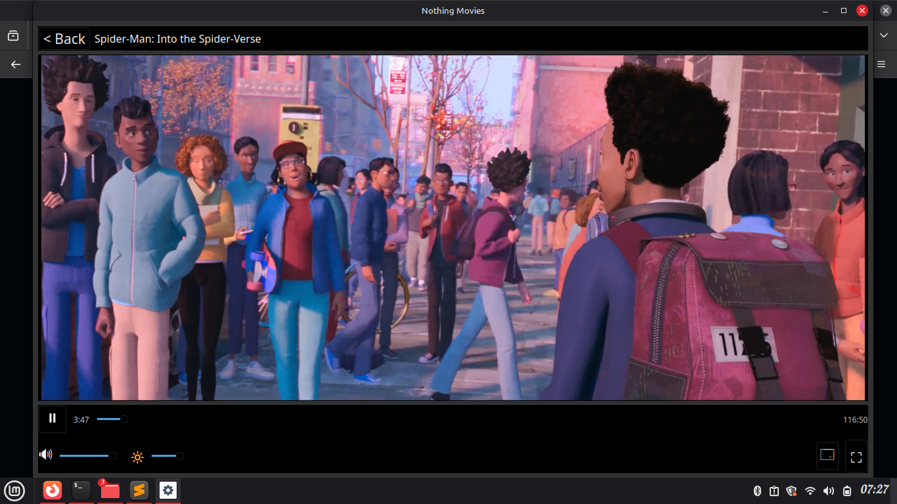
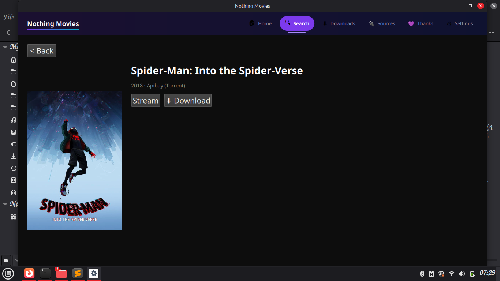
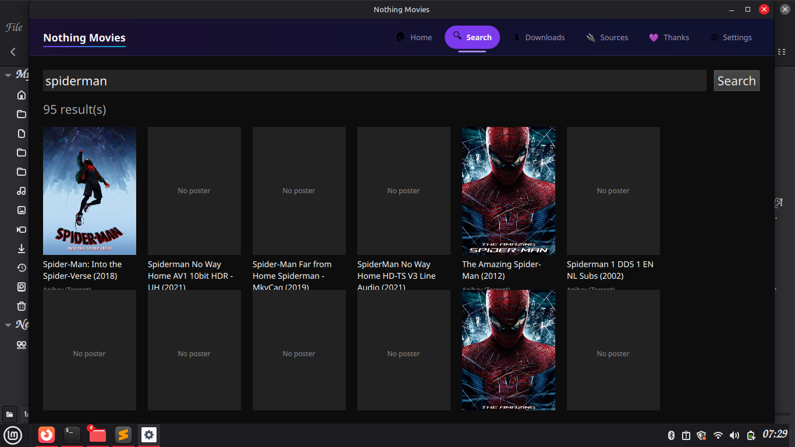
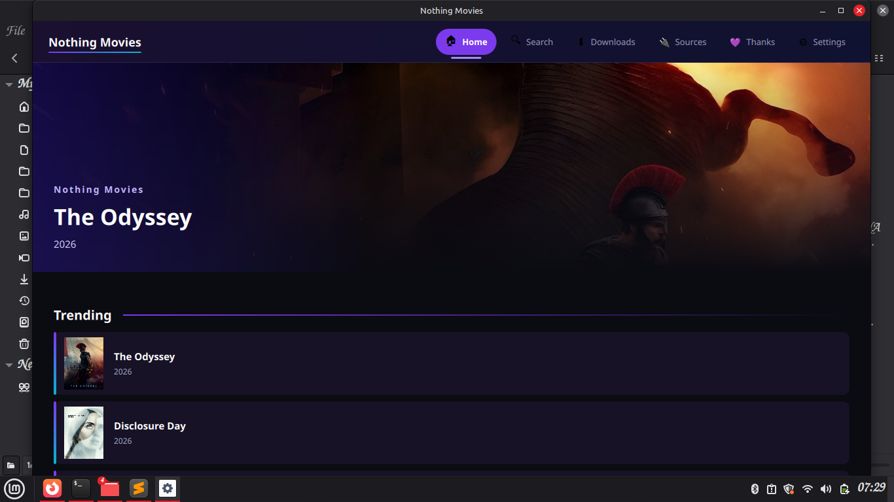
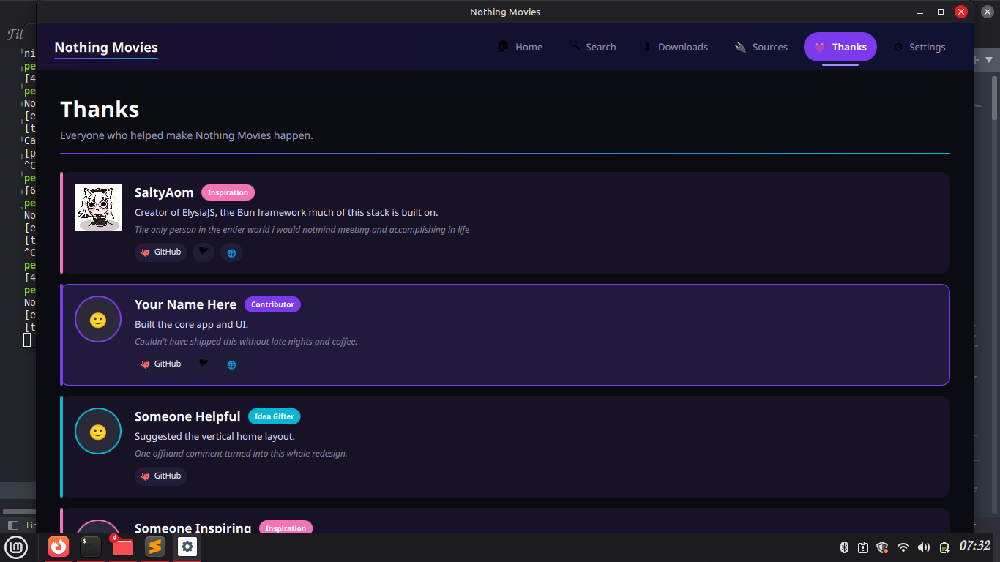
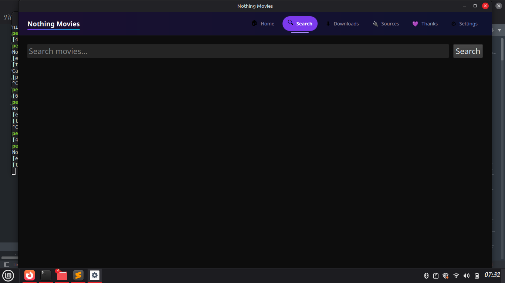
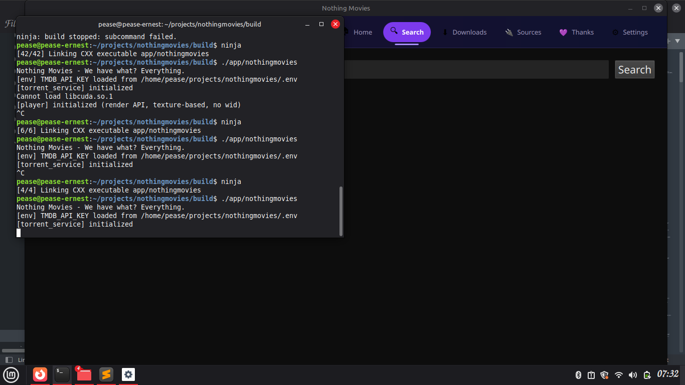

# Nothing Movies

**We have what? Everything.**

A cross-platform (Windows/Linux) movie downloader, torrent streamer, and video
player, built entirely in C++/Qt6. No JS, no Python, no Electron — one language,
one toolchain, top to bottom.

---

## What this is

Nothing Movies aggregates movie sources, downloads via torrent or direct HTTP,
and plays everything back through a fast, intuitive native player.

Nothing Browser is a reverse-engineering and source-discovery browser used to
inspect third-party sites, capture requests, and export working API calls into
clean integrations. It is not a bundled runtime component of Nothing Movies,
it is not shipped with the app, and it is not part of the final runtime
architecture.

The app's source layer is built around direct API/URL integrations. We do not
run browser scraping or browser automation in production. The browser is the
research tool used to find an API once, then the app calls that API directly in
C++.

Built and maintained with **Ernest Tech House** as main sponsor, hosting this
project under their GitHub organization.

## Status

Development is going better than expected. The player backend just had a
full rewrite: video used to be embedded via mpv's `wid` option, a raw native
window glued into the Qt layout that had to be manually fought for
compositing, overlays, and stacking order. It now renders through libmpv's
render API straight into an OpenGL FBO owned by a normal `QWidget` — the
same "video as a texture in your own draw pipeline" approach VLC's Qt
frontend uses. That one change already unblocks proper overlay controls,
in-app picture-in-picture, and reliable page switching with no native-window
workarounds needed.

Downloads screen now reflects what's actually sitting in the download folder
instead of only in-memory session state, so finished downloads survive an
app restart. Credits page is live.

UI is still rough — functionality first, styling later. Screenshots below
are straight from the dev build, warts and all.

## Screenshots

<p align="center">
  
  
  
</p>
<p align="center">
  
  
  
</p>
<p align="center">
  
</p>

## Architecture

Every component is an isolated module — no module reaches into another's
internals. Communication only happens through clean interface headers.

| Module | Responsibility |
|---|---|
| `core` | Shared interfaces (`ISourceProvider`, etc.) |
| `player` | libmpv-based video playback, render-API texture rendering (no native window embedding) |
| `torrent_service` | libtorrent-rasterbar, sequential streaming — the primary, reserved source (slot 1) |
| `downloader` | Generic HTTP/file downloads |
| `metadata_cache` | SQLite: posters, resume position, watch history |
| `search_aggregator` | Merges/ranks results across all sources |
| `queue_manager` | Unified download queue (torrent + HTTP) |
| `movie_source1/2` | Pluggable, isolated source providers (see slot system below) |
| `ui` | Qt Widgets frontend |
| `app` | Entry point, links everything together |

## Current sources

Nothing Movies currently relies on third-party services and APIs that are
already integrated into the app. We know this is true, and we are not trying
pretend otherwise. We also do not want a pile of more sources being dumped in
just because they work once.

Current in-app source relationships include:

- **KFlix** — metadata API powering titles, cast, posters, and related info
- **VidLove** — embed streaming API used for playback
- **RiveStream** — movie source API powering one of the current content feeds
- **YTS Official** — torrent API used for download functionality

These are all used as direct API/URL-backed integrations. Nothing Browser was
used during research to discover and inspect some of these APIs, but the app
itself does not bundle or depend on that browser. We do not support browser
scraping, selector-driven extraction, or any "just parse a random page and
hope it still works tomorrow" approach. We want direct access, not scraping
hacks.

## Building

```bash
mkdir build && cd build
cmake .. -GNinja
ninja
```

Requires Qt6 (Widgets, OpenGLWidgets, Quick, Qml), libmpv, libtorrent-rasterbar,
curl, nlohmann-json, miniz. See `CMakeLists.txt` in each module for exact
dependency targets.

## Versioning

Your current build version is always visible in **in-app Settings.**

- `v0.0.1-beta` (with `-beta` suffix) → **beta build** — may be unstable,
  may change without notice
- `v0.0.1` (no suffix) → **official/stable build**

Always check Settings and include your exact version string when reporting
a bug — see [`SECURITY.md`](./SECURITY.md) and issue templates.

---

## Project documents

Read these before contributing or filing issues:

| Document | What it covers |
|---|---|
| [`WARNING.md`](./WARNING.md) | What this project is and isn't for |
| [`LICENSE.md`](./LICENSE.md) | PolyForm Noncommercial 1.0.0 |
| [`ADDITIONAL_TERMS.md`](./ADDITIONAL_TERMS.md) | Extra conditions on top of the license |
| [`MOVIE_SOURCE.md`](./MOVIE_SOURCE.md) | Rules for submitting a movie source |
| [`MOVIE_SOURCE_LICENSE.md`](./MOVIE_SOURCE_LICENSE.md) | Ownership terms for accepted sources |
| [`CONTRIBUTING.md`](./CONTRIBUTING.md) | How to contribute code, bugs, or ideas |
| [`SECURITY.md`](./SECURITY.md) | Reporting vulnerabilities privately |
| [`CODE_OF_CONDUCT.md`](./CODE_OF_CONDUCT.md) | Expected behavior in project spaces |

## Contributing

Core improvements are welcome. New `movie_sourceN` modules are also welcome in
principle, but the bar is high and we are not trying to turn this into a
grab-bag of random source additions.

We know we use third-party sources. That is part of how the app works today.
It does not mean we want an unlimited stream of more sources or scraping-heavy
workarounds. We do not allow browser scraping, selector-based parsing, or
personal user-ID style integrations. A source has to be a direct URL/API call
that fits the project rules cleanly.

Read [`MOVIE_SOURCE.md`](./MOVIE_SOURCE.md) and
[`MOVIE_SOURCE_LICENSE.md`](./MOVIE_SOURCE_LICENSE.md) before submitting a
source. Acceptance is judged case by case, and not every working source gets
in.

## Community

Links coming soon — check back here once they're live.

## License

PolyForm Noncommercial 1.0.0. See [`LICENSE.md`](./LICENSE.md) and
[`ADDITIONAL_TERMS.md`](./ADDITIONAL_TERMS.md). Movie source contributions
are additionally governed by
[`MOVIE_SOURCE_LICENSE.md`](./MOVIE_SOURCE_LICENSE.md).

© 2026 Pease Ernest / Ernest Tech House

---

## Read this before you build against it

See [`WARNING.md`](./WARNING.md).